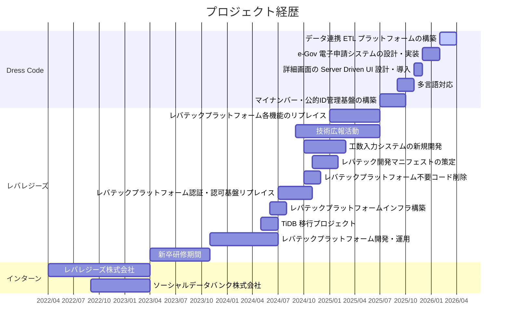

# 職務経歴書

## 職務要約

バックエンドを軸に、インフラ構築からフロントエンドまでフルスタックで開発を担当。マルチテナント型 HR SaaS では、AWS KMS によるテナント別暗号化基盤や DDD に基づくドメインモデル設計、Server Driven UI アーキテクチャの導入、e-Gov 電子申請システムの認証連携からエンドツーエンドフロー構築、AWS Step Functions / Lambda によるサーバーレス ETL プラットフォームの設計・構築など、セキュリティ・アーキテクチャ・インフラを横断した設計・実装を単独で推進。前職ではレガシーシステムのリプレイスで認証基盤をはじめ複数機能の設計・実装を一貫して担当し安定した移行を実現。TiDB 移行では約 300 万件のデータを扱う最大規模の DB 移行で発生した複数の障害の原因を特定しリペアスクリプトの作成・実行により復旧を完遂。チーム横断での運用ルール策定、技術広報活動など、技術面だけでなく組織改善にも幅広く取り組む。

## 基本情報

| 項目     | 内容                                               |
| -------- | -------------------------------------------------- |
| 氏名     | 内藤翔太（Shota Naito）                            |
| 生年月日 | 1999 年 3 月 9 日                                  |
| 最終学歴 | 慶應義塾大学大学院理工学研究科                     |
| GitHub   | [https://github.com/bwkw](https://github.com/bwkw) |
| X        | [https://x.com/_bwkw_](https://x.com/_bwkw_)       |
| Zenn     | [https://zenn.dev/mbao](https://zenn.dev/mbao)     |

## 強み

- **アーキテクチャ設計**: DDD / CQRS によるドメインモデル設計、Server Driven UI、手続き追加に対応するスケーラブルなレジストリパターン、サーバーレスデータパイプライン設計
- **バックエンド開発**: NestJS / Prisma / PostgreSQL での API 設計・実装、認証基盤（OIDC / JWT / OAuth 2.0 + PKCE）、e-Gov 電子申請連携
- **セキュリティ基盤**: AWS KMS によるテナント別暗号化、監査ログ・MFA 強制、マイナンバー法準拠のデータ管理設計
- **インフラ構築・運用**: AWS CDK / Terraform による IaC、Step Functions / Lambda / DynamoDB / Batch によるサーバーレス基盤、ECS / ALB / RDS 等の構築・運用
- **大規模コード変換・DX 改善**: AST 解析による約 600 ファイルの自動変換（50 時間→6 時間に短縮）、CI/CD 最適化、npm パッケージによる定義一元管理
- **システム移行・リプレイス**: 認証基盤リプレイス（障害 0 件で 9 ヶ月運用）、TiDB 移行（約 300 万件の障害復旧を完遂）、データ移行（23,000 件を障害ゼロで移行）
- **技術広報・育成**: 外部登壇 6 回（SRE Kaigi 2026 / AWS Summit 等）、技術ブログ執筆、未経験者 4 名の登壇サポート、勉強会設計・実施

## 技術スタック

### 言語・フレームワーク

### その他

## 保有資格

- 応用情報技術者試験 (2023/11)
- AWS Certified Solutions Architect - Associate (2023/08)
- 基本情報技術者試験 (2022/11)
- TOEIC Listening & Reading Test 835 点 (2020/11)

## 外部登壇実績

| 日付       | イベント                                                                                     | タイトル                                                                                                                                |
| ---------- | -------------------------------------------------------------------------------------------- | --------------------------------------------------------------------------------------------------------------------------------------- |
| 2026/01/31 | [SRE Kaigi 2026](https://2026.srekaigi.net/)                                                 | [制約が導く迷わない設計 〜 信頼性と運用性を両立するマイナンバー管理システムの実践 〜](https://speakerdeck.com/bwkw)                     |
| 2024/12/04 | [Nihonbashi Test Talk #3](https://nihonbashitesttalk.connpass.com/event/334396/)             | [ドメインロジックで考えるテスタビリティ](https://speakerdeck.com/leveragestech/tomeinrositukudekao-erutesutahiritei)                    |
| 2024/10/15 | [若手エンジニア ふんわり LT Night!](https://wakate-funwari-study.connpass.com/event/330981/) | [今日から始める技術的負債の解消](https://speakerdeck.com/leveragestech/jin-ri-karashi-meruji-shu-de-fu-zhai-nojie-xiao)                 |
| 2024/10/03 | [ペチオブ LT 会](https://phper-oop.connpass.com/event/329566/)                               | [ドキュメントとの付き合い方を考える](https://speakerdeck.com/leveragestech/dokiyumentotono-fu-kihe-ifang-wokao-eru)                     |
| 2024/09/11 | [New Relic User Group Vol.11](https://nrug.connpass.com/event/327828/)                       | [より快適なエラーログ監視を目指して](https://speakerdeck.com/leveragestech/yorikuai-shi-naerarokujian-shi-womu-zhi-site)                |
| 2024/06/21 | [AWS Summit Japan 2024](https://aws.amazon.com/jp/summits/japan-2024/)                       | [膨大なデータ活用のための Amazon QuickSight を使った技術構成](https://speakerdeck.com/leveragestech/amazon-quicksight-ji-shu-gou-cheng) |

## 職務経歴詳細

### プロジェクトタイムライン

| 期間             | プロジェクト                                                                                                        |
| ---------------- | ------------------------------------------------------------------------------------------------------------------- |
| 2026/02〜        | [データ連携 ETL プラットフォームの構築](#データ連携-etl-プラットフォームの構築202602)                               |
| 2025/12〜2026/01 | [e-Gov 電子申請システムの設計・実装](#e-gov-電子申請システムの設計実装2025122026012)                                 |
| 2025/11〜2025/12 | [詳細画面の Server Driven UI 設計・導入](#詳細画面の-server-driven-ui-設計導入202511202512)                         |
| 2025/09〜2025/10 | [多言語対応](#多言語対応202509202510)                                                                               |
| 2025/07〜2025/09 | [マイナンバー・公的ID管理基盤の構築](#マイナンバー公的id管理基盤の構築202507202510)                                 |
| 横断的           | [開発基盤・DX 改善](#開発基盤dx-改善横断的)                                                                         |
| 2025/01〜2025/06 | [レバテックプラットフォーム各機能のリプレイス](#レバテックプラットフォーム各機能のリプレイス202501202506)           |
| 2024/09〜2025/06 | [技術広報活動](#技術広報活動202409202506)                                                                           |
| 2024/10〜2025/02 | [工数入力システムの新規開発](#工数入力システムの新規開発202410202502)                                               |
| 2024/11〜2025/01 | [レバテック開発マニフェストの策定](#レバテック開発マニフェストの策定202411202501)                                   |
| 2024/10〜2024/11 | [レバテックプラットフォーム不要コード削除](#レバテックプラットフォーム不要コード削除202410202411)                   |
| 2024/07〜2024/10 | [レバテックプラットフォーム認証・認可基盤リプレイス](#レバテックプラットフォーム認証認可基盤リプレイス202407202410) |
| 2024/06〜2024/07 | [レバテックプラットフォームインフラ構築](#レバテックプラットフォームインフラ構築20240607)                           |
| 2024/05〜2024/06 | [TiDB 移行プロジェクト](#tidb-移行プロジェクト202405202406)                                                         |
| 2023/11〜2024/06 | [レバテックプラットフォーム開発・運用](#レバテックプラットフォーム開発運用202311202406)                             |
| 2023/04〜2023/10 | [新卒研修期間](#新卒研修期間202304202310)                                                                           |
| 2022/04〜2023/03 | [レバレジーズ株式会社（インターン）](#レバレジーズ株式会社202204202303)                                             |
| 2022/09〜2023/03 | [ソーシャルデータバンク株式会社（インターン）](#ソーシャルデータバンク株式会社202209202303)                         |

### Dress Code 株式会社（2025/07〜）

#### マイナンバー・公的ID管理基盤の構築（2025/07〜2025/10）

##### プロジェクト概要

- マイナンバーを含む高機密データのテナント別暗号化基盤、公的 ID 管理のドメインモデル設計、監査ログ・MFA ガード、CSV 一括登録機能を構築
- 参考：[制約が導く迷わない設計 〜 信頼性と運用性を両立するマイナンバー管理システムの実践 〜](https://speakerdeck.com/bwkw)（SRE Kaigi 2026 登壇）

##### 技術スタック

- TypeScript、NestJS、Prisma、PostgreSQL、AWS KMS、AWS S3、AWS CDK、Vitest、React

##### チーム情報

- 1 名（単独で設計〜実装）

##### 担当業務と力を入れた部分

- AWS KMS/S3 によるテナント別暗号化基盤
  - 担当
    - 設計、バックエンド、インフラ
  - 課題・問題点
    - マイナンバー法により暗号化が義務付けられており、マルチテナント SaaS においてテナント間のデータ分離を暗号化レベルで保証する仕組みが存在しなかった
  - 取り組みと成果
    - AWS KMS を使ったテナント別暗号鍵管理と暗号化・復号サービスを設計・実装。暗号化処理は CommandHandler に集約し、復号はマイナンバー取得時のみに限定
    - AWS S3 にテナント別の高機密ストレージバケットを SSE-KMS 暗号化で構築（CDK）。ファイルパスを絶対パスから相対パスへ変更し、HighlyConfidential な画像のストレージパスを分離することでアクセス経路を制御
    - 既存組織への KMS キー一括作成スクリプトも実装

- 公的 ID 集約の設計とドメインモデル
  - 担当
    - 設計、バックエンド
  - 課題・問題点
    - マイナンバーは日本固有の制度であり、将来的なグローバル展開を見据えると「公的 ID」として汎用的な集約設計が必要だった
    - 暗号化・監査ログ・利用目的管理・ファイル管理など複数の関心事が絡み合い、ビジネスロジックの散在リスクがあった
  - 取り組みと成果
    - PublicId（公的 ID）を集約ルートとし、NationalId（国民 ID）→ MyNumber → MyNumberFile の階層構造で設計。国ごとの ID 制度を NationalId のバリエーションとして拡張可能にした
    - CQRS を採用し、読み取りは QueryService に分離して画面最適化した SQL を組み立て可能にし、書き込みは Command → CommandHandler → Repository に統一
    - エンティティにバリデーション・マスク処理・チェックディジット計算等のビジネスロジックを凝集し、CommandHandler は KMS 暗号化と監査ログのオーケストレーションに徹する責務分離を実現
    - エンティティ・値オブジェクトをユニットテスト、CommandHandler の暗号化・監査ログ・永続化フローを統合テスト（実 DB 接続）で担保

- 監査ログ・MFA ガード
  - 担当
    - バックエンド
  - 課題・問題点
    - マイナンバー法では「誰が」「いつ」「何の目的で」アクセスしたかの記録が求められ、不正アクセス防止のための認証強化も必要だった
  - 取り組みと成果
    - 閲覧・作成・更新・削除すべてのアクションに対する監査ログ記録を CommandHandler 経由で実装。更新時には変更されたプロパティを明示的に記録し、変更差分の追跡を可能にした
    - ファイル操作は専用のファイル監査ログテーブルで別途管理
    - MFA ガード（SensitiveDataMfaGuard）を Controller に適用し、マイナンバー取得・CSV エクスポート/インポートに多要素認証を強制

- 公的 ID の CRUD・CSV 一括登録
  - 担当
    - バックエンド、フロントエンド
  - 課題・問題点
    - 大量の従業員の公的身分証明書を手作業で個別登録する運用負荷が高く、一括登録手段が求められていた
  - 取り組みと成果
    - パスポート・在留カード等の公的 ID の CRUD 機能と CSV インポート/エクスポート機能を構築。バリデーション付きで不正データを事前検出可能にした
    - フロントエンドでは HighlyConfidentialText コンポーネントやマスキング表示 UI を実装し、画面上でのセキュリティも確保

#### 多言語対応（2025/09〜2025/10）

##### プロジェクト概要

- バックエンドのエラーメッセージ多言語化基盤の設計、AST 解析による大規模コード変換ツールの開発、中国語簡体字の全プロダクト横断追加を担当
- 参考：[AST 解析で実現する大規模コードベースの効率的な変換](https://zenn.dev/dress_code/articles/codebase-transformation)

##### 技術スタック

- TypeScript、ts-morph、NestJS、React

##### チーム情報

- 1 名（単独で設計〜実装）

##### 担当業務と力を入れた部分

- 多言語エラーメッセージ基盤の設計
  - 担当
    - 設計、バックエンド
  - 課題・問題点
    - エラーメッセージの多言語化が場当たり的に実装されており、統一パターンがなかった。新たに言語を追加する際に全エラー箇所を個別修正する必要があり、スケールしない構造だった
  - 取り組みと成果
    - エラークラスに多言語メッセージを持たせる共通基底クラスを設計し、チーム全体の標準パターンとして確立
    - 既存のエラーハンドリング関数にも多言語メッセージを統合し、以降のすべての新規エラーが 6 言語（日本語・英語・インドネシア語・ベトナム語・タイ語・中国語簡体字）対応で作成される仕組みを整えた

- AST 解析による大規模コード変換の設計・実装
  - 担当
    - 設計、ツール開発
  - 課題・問題点
    - AI にファイル単位で翻訳・書き換えを任せるアプローチでは、1 ファイルあたり 5 分以上かかり全体で約 50 時間の見積もりだった。毎回ファイル全体の構造を解析するため無駄な再計算が発生し、処理速度と翻訳精度の両面で非効率だった
  - 取り組みと成果
    - 処理を「抽出（AST でコードベースから翻訳対象を一括検出・マーカー挿入）」→「翻訳（構造化データを AI に一括翻訳）」→「適用（AST で翻訳結果をソースコードに反映）」の 3 工程に分割
    - ts-morph による AST 解析でコード構造を理解した上での変更を可能にし、AI には純粋な翻訳タスクのみに集中させる設計とした
    - 当初 50 時間の見積もりを計 6 時間（実装 4 時間・実行 2 時間）に短縮

- 中国語簡体字の全プロダクト横断追加
  - 担当
    - バックエンド、フロントエンド
  - 課題・問題点
    - バックエンドのエラーメッセージ、フロントエンドの UI テキスト、属性定義ラベル、通貨・ロケール設定など、影響範囲が複数リポジトリ・約 600 ファイルにまたがり、整合性を保ちながら漏れなく対応する必要があった
  - 取り組みと成果
    - 多言語基盤と AST 変換ツールを活用し、バックエンドの全エラークラス・フロントエンドの全翻訳ファイル・属性定義マスタ・SDK（通貨・ロケール設定）に中国語簡体字を一括追加
    - 4 リポジトリ横断で整合性を保った 6 言語対応を完了

#### 詳細画面の Server Driven UI 設計・導入（2025/11〜2025/12）

##### プロジェクト概要

- 増え続ける詳細画面を統一的に構築するための Server Driven UI アーキテクチャを設計・導入し、複数画面へ適用
- 参考：[Server Driven UI で実現する詳細画面の統一アーキテクチャ](https://zenn.dev/dress_code/articles/server-driven-ui)

##### 技術スタック

- TypeScript、NestJS、Prisma、PostgreSQL、React、Vitest

##### チーム情報

- 1 名（単独で設計〜実装）

##### 担当業務と力を入れた部分

- Server Driven UI アーキテクチャの設計
  - 担当
    - アーキテクチャ設計、バックエンド、フロントエンド
  - 課題・問題点
    - 詳細画面が増えるたびにバックエンド・フロントエンドの両方をゼロから実装しており、開発コストが高かった。実装者によってレスポンス構造・多言語対応方式・フォームコンポーネントの選択が揺れ、コードベースの一貫性が損なわれていた
    - 権限制御もエンドポイントごとに個別実装されており、「このフィールドは誰が閲覧・編集できるか」の把握が困難だった
  - 取り組みと成果
    - 詳細画面の共通構造「セクション（カード）の中に属性（フィールド）が並ぶ」に着目し、バックエンドから Section/Attribute 構造の統一レスポンスを返す Server Driven UI を設計
    - 属性ごとに valueType（TEXT, DATE, SELECT 等）を持たせ、フロントエンドは valueType に応じて動的にコンポーネントを描画する仕組みとした
    - 多言語ラベルもバックエンド側で解決し、権限制御は属性キー単位で一元管理可能な構造を実現
    - チーム向けの設計ガイドラインとして体系化し、他画面への横展開を可能にした

- 複数画面への適用展開
  - 担当
    - バックエンド、フロントエンド
  - 課題・問題点
    - 各画面にはドメイン固有のバリデーション（法人番号のチェックディジット検証等）やデータ構造の違いがあり、共通アーキテクチャを維持しつつ個別要件を吸収する設計が求められた
  - 取り組みと成果
    - 契約企業情報（法人概要・登記情報・役員情報）、e-Gov 申請者プロフィール（事業所情報・申請者・連絡先）の詳細画面を本アーキテクチャで実装
    - 法人番号のチェックディジット検証を値オブジェクトで設計するなどドメイン固有のロジックはドメイン層に閉じつつ、画面の構造は統一レスポンスで返す形を維持
    - スキーマ定義・マイグレーション・シードデータ投入・統合テストを含めて構築

#### e-Gov 電子申請システムの設計・実装（2025/12〜2026/01）

##### プロジェクト概要

- 政府の電子申請 API（e-Gov）との認証連携、社会保険届出の申請データ構築、申請から公文書取得までのエンドツーエンドフローを構築

##### 技術スタック

- TypeScript、NestJS、Prisma、PostgreSQL、AWS KMS、AWS Secrets Manager、AWS CDK、xml-crypto、Vitest

##### チーム情報

- 1 名（単独で設計〜実装）

##### 担当業務と力を入れた部分

- 認証基盤と電子証明書管理
  - 担当
    - 設計、バックエンド、インフラ
  - 課題・問題点
    - e-Gov API は OAuth 2.0 + PKCE による認証と電子証明書によるデジタル署名を要求する。Refresh Token Rotation への対応や、電子証明書の暗号化保存・有効期限の自動管理など、セキュリティ要件が厳しかった
  - 取り組みと成果
    - OAuth 2.0 + PKCE 認証フローとトークンの自動更新（Refresh Token Rotation 対応）を実装
    - 電子証明書は AWS KMS で暗号化保存し有効期限の管理機能を構築。クライアントシークレットは AWS Secrets Manager で管理し、CDK でインフラをコード化

- 手続き追加に対応するスケーラブルなアーキテクチャ設計
  - 担当
    - 設計、バックエンド
  - 課題・問題点
    - 社会保険の届出手続きは種類が多く、それぞれ XML スキーマが異なる。手続きごとに個別実装すると、追加のたびにインフラからバックエンド・フロントエンドまで全レイヤーに変更が必要になり、スケールしない構造だった
  - 取り組みと成果
    - 手続きの種類をレジストリで一元管理し、新しい手続きの追加時は「XML ビルダーの実装」と「レジストリへの登録」のみで完結するアーキテクチャを設計
    - 共通の入力項目と手続き固有の入力項目を分離し、共通部分の再利用性を確保。健康保険・厚生年金取得届を初期手続きとして実装し、パターンの有効性を実証

- 申請から公文書取得までのエンドツーエンドフロー
  - 担当
    - バックエンド
  - 課題・問題点
    - 社会保険届出は紙・PDF ベースの手作業が中心で、1 件ずつ手書き・郵送で処理しており膨大な事務コストが発生していた
  - 取り組みと成果
    - 書式チェック・単件/一括送信・審査状況の同期・公文書ダウンロード・XML 署名検証までのエンドツーエンドフローを構築
    - チーム向けに認証連携・申請フロー・手続き追加の開発ガイドラインを 3 本策定し、他のメンバーが新しい手続きを追加できるナレッジ基盤を構築

#### データ連携 ETL プラットフォームの構築（2026/02〜）

##### プロジェクト概要

- 顧客が利用する外部 SaaS（Microsoft Entra ID, Google Workspace 等）や CSV ファイルから従業員データを自動取り込みするサーバーレスパイプラインを AWS 上にフルスクラッチで設計・構築
- 参考：[chardet の高バイト比率問題と多言語 CSV エンコーディング検出](https://zenn.dev/dress_code/articles/chardet-high-byte-ratio)

##### 技術スタック

- TypeScript、AWS Step Functions、AWS Lambda、DynamoDB、S3、AWS Batch、AWS CDK、NestJS、React、Vitest

##### チーム情報

- 2 名

##### 担当業務と力を入れた部分

- サーバーレスデータパイプラインの設計・構築
  - 担当
    - 設計、バックエンド、インフラ
  - 課題・問題点
    - 従来は SaaS ごとに個別の取り込み処理を構築しており、新しい SaaS や CSV 形式の追加のたびにインフラからコードまで個別実装が必要だった。API 連携と CSV アップロードの 2 系統を統一的に扱えるアーキテクチャが求められていた
  - 取り組みと成果
    - AWS Step Functions でパイプラインのワークフローを定義し、Lambda で各処理ステップ（ページ取得・データ正規化・取り込み等）を実装
    - API 連携と CSV アップロードの 2 系統を共通アーキテクチャ上に統一し、新しいデータソースの追加を定義ファイルの追加のみで完結する構造にした
    - インフラはすべて AWS CDK でコード化

- マルチテナントのデータ分離とリソース公平配分
  - 担当
    - 設計、インフラ
  - 課題・問題点
    - テナント A のデータをテナント B が読み取れてしまうリスクと、特定テナントの大量データ処理が他テナントの処理を圧迫するリスクの両方に対処する必要があった
  - 取り組みと成果
    - DynamoDB・S3 へのアクセスに対して IAM の動的セッションポリシーによるテナント単位のアクセス制御を実装し、テナント間のデータ境界をインフラレベルで保証
    - AWS Batch の Fair Share Scheduling を導入し、テナント間で処理リソースが公平に配分される仕組みを構築

- 複数データソースの統合パイプライン
  - 担当
    - 設計、バックエンド
  - 課題・問題点
    - 同一従業員の情報が複数の SaaS に分散しており、データの重複排除や名寄せの仕組みがなかった
  - 取り組みと成果
    - DynamoDB をステージング領域として使い、複数データソースからの取り込みデータをマージ・重複排除・差分検出する集約パイプラインを構築

- 多言語 CSV のエンコーディング自動検出
  - 担当
    - バックエンド
  - 課題・問題点
    - 各国のレガシーシステムからエクスポートされる CSV のエンコーディング（Shift_JIS, EUC-JP, TIS-620, Windows-1258 等）がバラバラで、文字化けによるデータ取り込み失敗が頻発していた。既存の検出ライブラリはタイ語・ベトナム語のシングルバイト系エンコーディングを検出対象外としており、ギリシャ語や西ヨーロッパ言語に誤検出される問題があった
  - 取り組みと成果
    - バイト列の統計的特徴（0×80 以上のバイトが占める割合）を利用した候補絞り込みと、デコード検証（言語固有文字の存在確認 + 文字化け増加チェック）を組み合わせた多段階の検出ロジックを設計・実装
    - 先頭 64KB のサンプルから判定し、ストリーム処理で変換する構成により大規模ファイルにも対応

- エラー可視化とリトライ基盤
  - 担当
    - バックエンド、フロントエンド
  - 課題・問題点
    - データ取り込みに失敗した場合、どの行のどのフィールドが原因かを特定する手段がなく、障害対応に時間がかかっていた。外部 API の一時的な障害に対するリトライも未整備だった
  - 取り組みと成果
    - エラー行を CSV でエクスポートし、顧客自身が取り込みエラーを確認・修正できる機能を構築
    - 指数バックオフによる自動リトライ基盤を実装し、開発ガイドラインとして文書化

- データフィールドの自動検出と動的マッピング
  - 担当
    - バックエンド、フロントエンド
  - 課題・問題点
    - 新しいデータソースを接続するたびに、エンジニアが手動でフィールドマッピングを定義する必要があり、顧客側での自律的なデータソース追加ができなかった
  - 取り組みと成果
    - アップロードされた CSV や API レスポンスからフィールドを自動検出し、GUI 上のドラッグ&ドロップでマッピングを定義できる UI をバックエンド API・フロントエンドともに構築
    - 顧客自身が新しいデータソースを接続可能にした

#### 開発基盤・DX 改善（横断的）

##### プロジェクト概要

- プロダクト全体の開発基盤改善と開発者体験向上のための横断的な施策を推進

##### 技術スタック

- TypeScript、GitHub Actions、Docker、ECR、Prisma、GitHub Packages

##### チーム情報

- 1 名（各施策を単独で推進）

##### 担当業務と力を入れた部分

- 属性定義の一元管理と npm パッケージ化
  - 担当
    - 設計、ツール開発、CI/CD
  - 課題・問題点
    - 属性定義がコードベースに散在しており、バックエンド・フロントエンド間で定義の不整合が発生していた。社内ライブラリとして Git Subtree で管理していたが、バージョン管理やリリースプロセスが未整備で更新追従が困難だった
  - 取り組みと成果
    - CSV/JSON から TypeScript の型定義を自動生成する仕組みを構築し、定義の不整合を解消
    - GitHub Packages に npm パッケージとして公開し、GitHub Actions でビルド・公開を自動化。依存先プロジェクトが semver でバージョン管理できる体制を整えた

- O/R マッパ メジャーバージョン対応（Prisma 6 移行）
  - 担当
    - バックエンド
  - 課題・問題点
    - 複数の View テーブルが次期バージョンで非対応となる予定があり、移行せずに放置するとアップグレードがブロックされる状態だった
  - 取り組みと成果
    - View テーブルを専用の QueryService に置き換える移行作業を完了し、メジャーバージョンアップを前倒しで実現

- CI/CD 最適化
  - 担当
    - DevOps
  - 課題・問題点
    - CI/CD のビルド時間が長く開発サイクルのボトルネックになっていた。コード品質のチェックが手動レビューに依存していた
  - 取り組みと成果
    - ECR Remote Cache・Dockerfile 最適化・Turbo キャッシュにより CI/CD ビルド時間を短縮
    - pre-commit フック（lint + format 自動実行）を導入しコード品質を自動担保

### レバレジーズ株式会社（2023/04〜2025/06）

#### レバテックプラットフォーム各機能のリプレイス（2025/01〜2025/06）

##### プロジェクト概要

- 内部品質と外部品質の向上を目指し、各機能のリプレイスと開発プロセス改善を担当
- 参考：[リプレイス1年の現場で見えた、やって良かった7つのこと](https://zenn.dev/levtech/articles/replace-good)

##### 技術スタック

- TypeScript、Next.js、PHP、Prisma、Volt（デザインシステム）、Figma、Docker、Terraform、AWS (ECS / CloudWatch)、NewRelic、ESLint

##### チーム情報

- 3〜5 名

##### 担当業務と力を入れた部分

- 各機能のリプレイス実装
  - 担当
    - フロントエンド、バックエンド、品質管理
  - 課題・問題点
    - 既存システムに不適切なバリデーションや文字化けの問題が存在
    - リプレイス後の仕様について、チーム全体での合意形成が必要
    - データ移行を安全に実施する必要が存在
    - 新しい技術スタック（Volt（デザインシステム）、Figma Dev Mode）を使用する初めての取り組み
  - 取り組みと成果
    - 既存システムの外部仕様調査で不適切なバリデーションを特定し、最適化を提案・実装。網羅的なテストで文字化け問題も解決
    - テックリード・ディレクター・開発メンバーとの議論の場を設け、チーム全体の意見を反映しながらリプレイス後の仕様を確定
    - データ移行を 7 段階に分解し、並行運用基盤の構築・データ整合性検証・段階的な参照切り替えにより、約 23,000 件を障害ゼロで移行
    - 初導入の Volt・Figma Dev Mode は管理チームと連携して知識を収集し、モブプログラミングでチーム内の認識を統一
    - リプレイス完了後から退職まで大きな障害なく安定稼働を実現

- プロセス改善と品質管理
  - 担当
    - プロセス改善、品質管理
  - 課題・問題点
    - 複数チームが触る複数のリポジトリで Git 運用ルールが未策定で、想定外の修正が本番環境にデプロイされるリスクが存在
    - 環境構築手順が複数存在し、各チームで異なる環境を使用。環境変数設定ファイルが散らかり秘匿情報の誤公開リスクが存在
    - リプレイスにあたり、共通認識化のためのコミュニケーションコストと作業の属人化が課題
  - 取り組みと成果
    - Git 運用ルールをゼロから作成し、3 チーム約 10 名で合意形成。フロー図として可視化し、導入後はマージ事故ゼロを達成、レビュー依頼の明確化やリリース管理の効率化にも貢献
    - 環境構築手順を統一し、環境変数設定ファイルの責務を明確化することで、各チームが同じ環境で開発できる体制を構築
    - モブプログラミングを導入し、ドライバー、ナビゲーター、サポーターの役割の明確化と 15 分での交代制、振り返りの導入、Todo リストの作成などをルール化

- 運用改善
  - 担当
    - DevOps
  - 課題・問題点
    - 現システムのログ情報不足により運用負荷が高い状態
    - リリース後に継続的に運用できる持続可能性の担保が必要
    - ECS の夜間停止設定がされておらず、無駄なリソース消費が発生
    - CI/CD の実行時間が長く、開発効率が低下
  - 取り組みと成果
    - ログ設計指針を策定し、「担当者識別情報」「ユーザへの影響」「即時対応の必要性」を出力するよう変更。AsyncLocalStorage を活用してリクエストごとのコンテキスト情報を保持することで、エラー発生ユーザを迅速に特定できる体制を構築
    - 担当チームのダッシュボードを 0→1 で作成し、認証や各機能に特化したダッシュボードを複数作成。メトリクスを見る会の設計により継続的に監視できる体制を整え、メモリや CPU 使用率の閾値を設定して Slack へのアラートを設定し、システムの安定稼働を実現
    - STG 環境と DEV 環境で ECS の夜間停止設定を実施し、無駄なリソース消費を削減
    - ECR リモートキャッシュを導入し、CI/CD の実行時間を短縮

#### 技術広報活動（2024/09〜2025/06）

##### プロジェクト概要

- 組織内外への技術発信と知見共有を通じて、ブランド力向上とエンゲージメント向上を担当

##### 担当業務と力を入れた部分

- 技術広報活動の推進
  - 課題・問題点
    - 組織のブランド力向上とエンゲージメント向上が部門の重点課題
    - 良い取り組みをしていても情報共有に躊躇するメンバーが多く、外部登壇未経験者が大半
  - 取り組みと成果
    - 部門の重点課題に対して自発的に技術広報チームにジョインし、「外部露出を促進し技術的な価値発信を強化する」という目標を設定
    - 社内 LT の運営に立候補し、未経験登壇者 7 名に声をかけて社内での技術発信文化を醸成。登壇者への感想を集めて本人に伝える仕組みや、KPI を話し手・聞き手別に収集する方法を導入
    - 外部登壇のサポートでは、テーマ選定から資料レビュー、当日の同行まで一貫して支援。DocBase で手順とスライド作成のコツを整備し、未経験者 4 名の外部登壇を実現
    - 自らも 6 ヶ月で 5 回の外部登壇を実施し、組織の認知度向上に直接貢献（詳細は「外部登壇実績」セクション参照）

#### 工数入力システムの新規開発（2024/10〜2025/02）

##### プロジェクト概要

- 営業メンバーの生産性向上を目的とした工数可視化システムの開発を担当
- 参考：[Chrome 拡張「工数入力くん」で日々の工数管理を効率化](https://zenn.dev/levtech/articles/kosu-nyuryoku)

##### 技術スタック

- TypeScript、Chrome Extension、Prisma、Google Calendar API

##### チーム情報

- 2〜3 名

##### 担当業務と力を入れた部分

- 工数入力システムの開発
  - 担当
    - フロントエンド、バックエンド、プロジェクト管理
  - 課題・問題点
    - 営業組織の拡大に伴い、業務時間の工数可視化が急務
    - 既存のスプレッドシートでの可視化はメンバーへの負担が大きい状況
    - 将来的なデータ可視化時のパフォーマンス劣化リスクが存在
  - 取り組みと成果
    - 自発的に Chrome 拡張機能の開発へ名乗りを上げ、2025 年 1 月前半にベータ版、同月後半に本リリースを実施
    - 2025 年 1 月からの運用開始に向け、運用に必要なタスクを洗い出し担当者と期日を設定。各リリースにおいてテスト観点の洗い出しとテスト実行を徹底
    - Google Calendar 連携機能では、リトライ機構による信頼性向上、チャンク処理による DB 負荷最適化、月単位パーティションによるパフォーマンス劣化防止を実装。本番導入以降、システムダウンやデータ不整合なく安定稼働を実現

#### レバテック開発マニフェストの策定（2024/11〜2025/01）

##### プロジェクト概要

- レバテック開発部の価値観と行動指針を明確化する「レバテック開発マニフェスト」の策定を担当

##### 担当業務と力を入れた部分

- レバテック開発マニフェストの策定
  - 担当
    - ファシリテーション、組織開発
  - 課題・問題点
    - 事業への価値貢献の幅を広げるため、一貫性のある行動と共通の目標に向かう必要性が存在
  - 取り組みと成果
    - 「レバテック開発マニフェスト」の策定を推進。約 10 回の会議でファシリテーションを担当し、メンバーの意見を 3 つの行動指針に体系化して 2025 年 1 月に ver1.0 を公開
    - 月次共有会でアンケートを実施し、開発部メンバー約 90％から納得感を獲得。スタンプや表彰制度を導入し、組織への浸透を推進

#### レバテックプラットフォーム不要コード削除（2024/10〜2024/11）

##### プロジェクト概要

- リプレイスを迅速かつ安全に進めるための不要コード削除を担当

##### 技術スタック

- Python、CloudWatch Logs Insight

##### チーム情報

- 1 名（個人担当）

##### 担当業務と力を入れた部分

- 不要コード削除の推進
  - 担当
    - バックエンド、運用改善
  - 課題・問題点
    - 不要コードが残ることでセキュリティリスク発生の懸念が存在
    - リプレイス対象の仕様を把握し、置き換え対象を明確にする必要が存在
  - 取り組みと成果
    - CloudWatch Logs Insight で正規表現を用いてアクセスパスを抽出し、ルーティング定義と照合することで削除対象を特定。Apache ログに記録されない PHP アプリケーション内部での処理を見逃さないよう、最終確認用のログを仕込み安全性を担保
    - 不要コード削除の手順を明確化し、タスクとして誰でも対応できる状態を整備。結果として 1 か月で約 30 本の API / 1,500 行のコードを削除し、セキュリティリスクを低減

#### レバテックプラットフォーム認証・認可基盤リプレイス（2024/07〜2024/10）

##### プロジェクト概要

- 既存システムから新システムへの認証・認可機能のリプレイスを担当

##### 技術スタック

- TypeScript、Next.js、NestJS、Redis、AWS (ALB)、OIDC、JWT

##### チーム情報

- 4〜5 名

##### 担当業務と力を入れた部分

- 認証・認可基盤のリプレイス
  - 担当
    - フロントエンド、バックエンド、設計
  - 課題・問題点
    - 既存システムの Redis をセッション代わりに使用しており、新システムへの移行時に既存サービスとの不整合やセキュリティリスクを防ぐ必要が存在
    - チーム内で OIDC や認可制御（RBAC / PBAC）の知識が不足
  - 取り組みと成果
    - チームの知識不足を補うため、OIDC と認可制御（RBAC / PBAC）の勉強会を設計・実施（参考：[OIDC を Hono × Bun で完全に理解する](https://zenn.dev/levtech/articles/what-is-oidc)）。OIDC では「[OAuth、OAuth 認証、OpenID Connect の違いを整理して理解できる本](https://techbookfest.org/product/4885634867003392?productVariantID=6565720896831488)」を使用し、RBAC / PBAC では議論を通じてハイブリッド形式が最適との結論に達し、チーム内で共通認識を形成
    - 各サービスから Redis に対して行っているセッション情報の読み書き処理をすべて調査し、既存システムとの不整合を避けながら移行できるよう設計
    - 認証基盤移行後から退職まで約 9 ヶ月間、認証基盤による障害は 0 件で、安定したシステム運用を実現

#### レバテックプラットフォームインフラ構築（2024/06〜07）

##### プロジェクト概要

- リプレイスに伴うインフラ構築を担当

##### 技術スタック

- Terraform、AWS (ECS / ALB / NLB / VPC / CloudWatch / Route53 / Secrets Manager)

##### チーム情報

- 1 名（個人担当）

##### 担当業務と力を入れた部分

- インフラ構築
  - 課題・問題点
    - リプレイスに伴い、新規インフラ構築が必要
    - Terraform で構築した ECS へのアクセスに失敗する問題が発生
  - 取り組みと成果
    - Terraform で ECS、ALB、NLB、VPC、CloudWatch、CloudTrail を構築
    - VPC のルーティングテーブル、NLB と ECS のセキュリティグループ、NLB のターゲットグループ、ECS のコンテナ公開ポートを順に検証し、NLB のターゲットグループ設定にトラフィック転送先ポートの誤りを発見し、問題を解決

#### TiDB 移行プロジェクト（2024/05〜2024/06）

##### プロジェクト概要

- レバテックでもっとも歴史があり最大容量の DB を Amazon RDS から TiDB へ移行する作業を担当
- [Amazon RDS から TiDB 移行時のしくじり集](https://zenn.dev/levtech/articles/bc0786a0c7c849)

##### 技術スタック

- Python、Shell Script、MySQL、TiDB、AWS DMS

##### チーム情報

- 4 名

##### 担当業務と力を入れた部分

- データ移行時の障害対応と復旧
  - 担当
    - データベース、運用
  - 課題・問題点
    - TiDB の AUTO_INCREMENT のキャッシュが更新されず、Duplicate Key Error が発生
    - TIMESTAMP 型のデータに 9 時間のずれが発生
    - NO_ZERO_DATE の影響で移行できていないデータが存在
    - BLOB 型のデータが 32KiB までしか連携されていない状態
    - 全角検索でヒットしなくなる問題が発生
  - 取り組みと成果
    - TiDB の各ノードが異なる採番帯を持つ仕組みを調査し、`ALTER TABLE` による採番キャッシュのリセットで全テーブルの問題を解消
    - 全テーブルを調査してリペアが必要なテーブルとカラムを特定し、約 300 万件のデータに対してバッチ処理での自動更新スクリプトを作成して完遂
    - awsdms_apply_exceptions から INSERT や UPDATE が失敗しているデータを確認し、データリペアを実施
    - 移行元 DB からダンプファイルを取得し、Blob→Hex 変換後に移行先 DB へ取り込み、UPDATE 文でデータを復旧
    - Collation が誤って変更されていることを特定し、`utf8mb4_unicode_ci` に修正して解決

- 組織への知見共有と再発防止
  - 課題・問題点
    - 他チームも TiDB 移行を控えており、同様の障害発生リスクが存在
  - 取り組みと成果
    - 社内 LT で TiDB 移行時のしくじりと教訓を発表
    - CTO や SRE チームと連携しながら TiDB 移行チェックシートを作成し、他チームが移行時に確認すべき項目を明確化
    - チームメンバーに TiDB の AUTO_INCREMENT の仕組みを説明し、問題解決をサポート
    - 1 コマンドで起動できる TiDB ローカル環境のスクリプトを作成し、開発部全体に共有

#### レバテックプラットフォーム開発・運用（2023/11〜2024/06）

##### プロジェクト概要

- IT エンジニアやクリエイター向けの専用マイページで、案件検索、スカウト受け取り、契約・請求事務処理などを提供するレバテックプラットフォームの開発・運用を担当

##### 技術スタック

- TypeScript、NestJS、Prisma、Python、BigQuery、Google Sheets、Terraform、AWS (EventBridge)、NewRelic、Autify、DDD

##### チーム情報

- 5〜6 名

##### 担当業務と力を入れた部分

- 重複 CV 改善施策の設計・実装
  - 担当
    - バックエンド、設計
  - 課題・問題点
    - 新規機能のため、アーキテクチャや技術選定から検討が必要
    - 将来の機能拡張を見据えた拡張性の高い設計が求められる状況
    - 複数システム（認証基盤、外部サイト）との連携が必要
  - 取り組みと成果
    - AWS EventBridge によるイベント駆動アーキテクチャを採用し、システム間の疎結合を実現
    - DDD と DIP を採用し、ドメイン層とインフラ層に分割することで各層の責務を明確にし、拡張性と保守性を向上
    - 認証基盤チームや外部サイト連携チームとの接点を整理し、EventBridge デプロイ時のパラメータ連携を事前に依頼

- 業務自動化と効率化
  - 担当
    - バックエンド、運用改善
  - 課題・問題点
    - 経理・営業からのデータ集計依頼が複数あり、手動作業によるミスや工数負担が課題
  - 取り組みと成果
    - BigQuery と Google Sheets を連携した自動集計の仕組みを 4 件構築し、手作業によるミスのリスクを排除（請求書情報一覧、月次案件検索条件集計、評判表示率集計、CSV データ検証）

- チーム開発プロセスの改善
  - 課題・問題点
    - ドキュメントの散在と属人化により、情報の検索性・メンテナンス性が低下
  - 取り組みと成果
    - GitHub を中心としたドキュメント管理方針を策定し、オーナー制度の導入と CI/CD による自動更新で継続的なメンテナンス体制を構築。また、問い合わせ対応フローを整備し、ナレッジ蓄積を実現

- インフラとモニタリングの改善
  - 担当
    - インフラ、DevOps
  - 課題・問題点
    - AWS リソースの上限管理が適切に行われておらず、E2E テスト環境の拡張に支障が発生
    - Terraform による IaC と実環境の差分が発生し、運用の信頼性が低下
    - 他チームが利用する共通モジュールでの設定ミスを防ぐ仕組みが不足
  - 取り組みと成果
    - AWS Service Quotas の調査と SRE チームとの連携により、リソース上限を最適化
    - Terraform の公式ドキュメントと技術記事を参照し、IaC と実環境の差分を適切に管理する運用方針を確立
    - 共通モジュールにバリデーション機能を実装し、設定ミスの早期検出とエラーメッセージによるガイダンスを実現
    - 外部勉強会で NewRelic の新機能を学習し、外形監視（Synthetic Monitoring）を導入してシステムの可観測性を向上
  - 参考
    - [我々はまだ知らなかった。NewRelic の真の姿を](https://zenn.dev/levtech/articles/newrelic-less-known-features)

#### 新卒研修期間（2023/04〜2023/10）

##### プロジェクト概要

- クイズアプリ開発、ATS（採用管理システム）開発を通じた実践的な研修に参加

##### 技術スタック

- TypeScript、Next.js、Remix、NestJS、Prisma、Socket.IO、Terraform、AWS

##### チーム情報

- 4 名

##### 担当業務と力を入れた部分

- クイズアプリ開発（15 営業日）
  - 担当
    - インフラ、バックエンド、フロントエンド
  - 課題・問題点
    - チームメンバーが実装に慣れておらず、進捗が予定より遅延
    - 開発期間が 15 営業日と短く、タスクの優先順位付けが重要
  - 取り組みと成果
    - Socket.IO を使用したリアルタイム通信機能を実装し、複数チームが同時参加できるクイズシステムを構築
    - インフラ関連のタスクが他のタスクのブロッカーになっていることに気づき、自身の開発タスクを一時停止してインフラ環境構築を優先的に進め、チーム全体の開発を円滑化

- ATS 開発での設計リードと品質向上（3 ヶ月）
  - 担当
    - バックエンド、インフラ、設計
  - 課題・問題点
    - チーム内でバックエンド設計の知識が不足しており、実装方法のバラツキと保守性の低下が懸念
    - 既存システムの仕様をそのまま実装すると、データモデルの複雑化による保守性低下の懸念が存在
  - 取り組みと成果
    - モジュラモノリス勉強会への参加と技術メンターとの設計議論を通じて、NestJS + Prisma を用いたレイヤードアーキテクチャを設計。ディレクトリ構成と各ファイルの責務を明確に定義し、チーム全体の設計認識を統一
    - 既存システムの仕様を鵜呑みにせず、実際の採用プロセスを基に UI とデータモデルを再設計し、コードの複雑性を低減

- チームメンバーの技術サポートと育成
  - 担当
    - メンター、ナレッジ共有
  - 課題・問題点
    - チームメンバーが NestJS、Prisma などの技術に不慣れで、開発の滞る場面が存在
    - 知識を伝えるだけでは自走できるレベルまで理解が深まらない状況
  - 取り組みと成果
    - NestJS と Prisma のキャッチアップ用リポジトリを作成し、PostgreSQL の Docker 環境、Prisma のスキーマ定義と使用法、NestJS のリポジトリ構成・API 実装、Swagger の使用法などを整備。後日、このリポジトリを基にペアプログラミングを実施
    - 質問を交えてチームメンバーが自ら考える時間を増やすコーチング手法に切り替え、実践的な理解を深めるよう支援

- プロジェクト管理の改善
  - 担当
    - プロジェクト管理、プロセス改善
  - 課題・問題点
    - ウォーターフォール型の開発手法では、顧客の負担が増大し、変更要望への柔軟な対応が困難
  - 取り組みと成果
    - 開発手法をアジャイル型に切り替え。ただし、リプレイスプロジェクトで要件が確定していることを考慮し、要件定義と設計は事前に完了させ、開発フェーズのみをユーザストーリー単位で反復的に進めるハイブリッド型アプローチを採用

## インターン経歴詳細（大学院在籍時）

### レバレジーズ株式会社（2022/04〜2023/03）

#### 稼働ペース

- 平均週 2 日（実働 16〜20 時間）

#### プロジェクト概要

- 新卒採用向け動画面接サービスの設計からバックエンド開発、インフラ環境移行を担当

#### 技術スタック

- PHP、Laravel、Laravel Sanctum、MySQL、Shell Script、nginx、systemd、AWS (Route53 / VPC / EC2 / RDS / S3 / Lambda / Secrets Manager / CloudWatch / SES)

#### チーム情報

- 4〜6 名

#### 担当業務と力を入れた部分

- 要件定義〜仕様決定
  - 担当
    - 要件定義、ドキュメント整備
  - 課題・問題点
    - 決定した仕様は仕様書にまとめていたものの、仕様決定の背景が整理されておらずチーム内で仕様決定の背景を確認する議論が繰り返される状態
  - 取り組みと成果
    - 仕様決定時に考慮事項と決定背景をまとめるようチームに促し、不要な議論の時間を削減

- Laravel での API 開発
  - 課題・問題点
    - Laravel に初めて触れるメンバーが多かったため、習得の負担を軽減する必要が存在
    - リリースの時期の観点から、自身が比較的重い機能を担当する必要が存在
  - 取り組みと成果
    - 小規模システムで Laravel 初学者がいることを考慮し、キャッチアップをほぼ必要とせず責務を分けて実装できる MVCS 構成を採用
    - 脆弱性（CSRF / XSS）対策の容易性と SPA への拡張を考え、Laravel Sanctum による SPA 認証を採用
    - AWS サービスとの統合と無料枠内のメール数を重視し、AWS SDK for PHP × Amazon SES でメール機能を実装。メール送信に必須の SPF と DKIM を整備し、バウンス率を低く抑制

- AWS の環境移行
  - 課題・問題点
    - AWS アカウント間でのインフラ環境移行が必要で、サービスへの影響を最小限に抑える必要が存在
    - チーム全体でインフラに関する知識が不足しており、ゼロから学習する必要が存在
  - 取り組みと成果
    - 手作業による冪等性の低下を防ぐため、各種コマンドをシェルスクリプト化。EC2、RDS、S3 の段階的移行戦略を立案し、本番環境では php-fpm の再起動と RDS のロック約 15 秒のダウンタイムで移行を実現
    - Route53、VPC、EC2、RDS、S3、Lambda、Secrets Manager、CloudWatch などの AWS リソース、systemd、nginx、SSH ポートフォワードなどの技術を習得し実践に活用

- チーム開発体制の改善
  - 課題・問題点
    - 作業の進捗や課題の共有が不十分であり、チームの協働効率が低下
    - 心理的安全性の不足により、質問や相談のしづらい雰囲気が存在
    - 新メンバーのオンボーディングプロセスが整備されておらず、立ち上がりに時間を要する状態
  - 取り組みと成果
    - 分報を導入し、作業の進捗と課題を可視化。これにより課題解決のスピードが向上し、心理的安全性が担保された空間づくりに成功
    - 1 日 15 分の学びシェアの会を企画し、チーム全体の学習意欲向上とナレッジ共有を促進
    - 参照ドキュメントと環境構築手順を整備し、分報による進捗把握と適宜サポート体制を構築することで、新規メンバーのオンボーディング期間を短縮

### ソーシャルデータバンク株式会社（2022/09〜2023/03）

#### 稼働ペース

- 平均週 2 日（実働 16〜20 時間）

#### プロジェクト概要

- LINE 公式アカウントの配信・運用・管理サポートサービス Liny の開発と DevOps を担当

#### 技術スタック

- TypeScript、Vue2、Vue3、PHP、Laravel、webpack、Vite、GitHub Actions、Notion DB、Google Sheets

#### チーム情報

- 20 名（開発チーム）、2 名（DevOps チーム）

#### 担当業務と力を入れた部分

- API パフォーマンスの最適化
  - 課題・問題点
    - API のレスポンスサイズが大きく、応答速度が遅いことでユーザ体験が低下
  - 取り組みと成果
    - 必要なデータの洗い出しとボトルネックの特定により、レスポンスサイズを 52％削減（2.3MB → 1.1MB）、応答時間を 68％短縮（4.11s → 1.31s）。デプロイ後もリグレッションは発生せず、安定した改善を実現

- フロントエンド技術スタックの刷新
  - 課題・問題点
    - Vue2 のサポート終了に伴う未更新パッケージの増加と、長いビルド時間による開発者体験の低下
  - 取り組みと成果
    - Vue3 と Vite への移行環境を整備し、レガシーパッケージからの脱却とビルド時間の大幅な短縮により、開発者体験を向上

- 開発生産性の可視化と改善
  - 課題・問題点
    - 開発プロセスのパフォーマンスが可視化されておらず、ボトルネックの特定や改善施策の効果測定が困難
  - 取り組みと成果
    - GitHub Actions、Notion DB、Google Sheets を活用し、変更のリードタイム（PR 作成からマージまでの時間）を自動測定する仕組みを構築。運用コストゼロで継続的な測定を実現
    - 個人別・プロジェクト別のメトリクスを各チームに展開し、毎週の振り返りで改善施策を推進。その結果、全チームでリードタイムを削減
